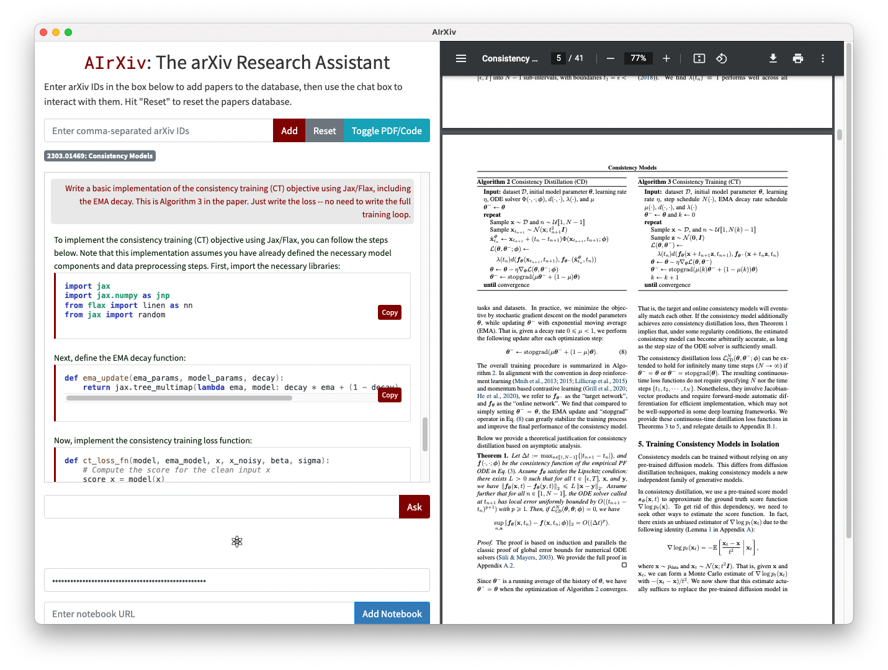

<h1 align="center">
# AIrXiv
</h1>

<h4 align="center">
[](https://opensource.org/licenses/MIT)
[](https://github.com/smsharma/AIrXiv/pulls)
</h4>

AIrXiv is a prototype for an LLM-powered ArXiv research assistant. It is an Electron-powered app with a Flask backend and uses the OpenAI API. 



- [AIrXiv](#airxiv)
  - [Implementation Notes](#implementation-notes)
  - [Installation](#installation)
  - [Usage](#usage)
  - [License](#license)

## Implementation Notes

- When papers are added, AIrXiv attempts to extract the TeX source of the papers. This was found to work better when it comes to accurately transcribing equations and algorithms. If this fails, PDF extraction is used.
- AIrXiv uses a simple top-k similarity search from a FAISS vector store. k can be set in config.yml, along with the chunk size and stride length of  chunks.
- Frontend elements are in `static`, and backend elements are in `util` and `main.py`.

## Installation

0. (Prerequisites) Make sure you have [Node.js](https://nodejs.org/en/download) (LTS version recommended) and Python >=3.7.
1. Clone and `cd` into the repo:
```
git clone https://github.com/smsharma/AIrXiv.git
cd AIrXiv
```
2. Install the required Python packages using the provided environment.yml file. You can use Conda or any other environment manager of your choice:
```
conda env create -f environment.yml
conda activate airxiv
```
3. Install the required Node.js packages by running the following command:
```
npm install
```

## Usage

Run the Electron app with 
```
npm run dev
```
which launches the Python/Flask backend (`python main.py`) as well as the frontend (`npm start`). Add an arXiv ID or two, enter your [OpenAI API Key](https://platform.openai.com/account/api-keys) in the text box towards the bottom, and start asking questions!

Usage notes:
- Either `gpt-3.5-turbo` or `gpt-4` can be selected in the app settings. `gpt-4` is significantly better in particular at implementing code, but is about an order of magnitude more expensive (~$0.02/1000 tokens) compared `gpt-3.5-turbo`, and additionally API access is subject to a [waitlist](https://openai.com/waitlist/gpt-4-api).
- Paper querying can be turned off by checking "Don't query papers" in the settings. This then simply relies on the general capabilities of the model.

## License

AIrXiv is licensed under the [MIT License](LICENSE.md).